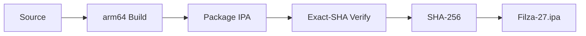

<div align="center">

# ✦ 𖤐 FILZA 27 𖤐 ✦

### `MODERN iOS FILE MANAGER`


<br />

`────────────────────────────────────────────`

<table>
<tr>
<td align="center" width="50%">
<a href="https://giphy.com/gifs/pokemon-approaching-mega-gengar-phantasmal-flames-2Xk7V7X97R5gmfUTqx">

</a>
</td>
<td align="center" width="50%">
<a href="https://giphy.com/gifs/neon-vaporwave-retrowave-QTxF50wnvVaXDU3IJQ">

</a>
</td>
</tr>
</table>

<sub>Pokémon · neon · glitch · iOS · Filza</sub>

<br /><br />

[](https://github.com/NightVibes33/Filza-27/actions/workflows/verify-upstream-byetunes-ssh.yml)
[](https://github.com/NightVibes33/Filza-27/releases/latest)
[](https://github.com/NightVibes33/Filza-27/releases)
[](https://github.com/NightVibes33/Filza-27/stargazers)

<br />

[](https://github.com/NightVibes33/Filza-27/releases/latest/download/Filza-27.ipa)
[](RELEASE_NOTES.md)
[](https://github.com/NightVibes33/Filza-27/actions)

<br />

**A modern sideloadable Filza build for browsing, inspecting and managing files on modern iOS.**

`Filza 4.11` · `arm64` · `sideloadable` · `exact-SHA verified releases`

<br />

`BROWSE  ·  INSPECT  ·  MANAGE  ·  ARCHIVE`

<br />

[**Download**](#download) · [**Filza Core**](#filza-core) · [**Scene**](#scene) · [**Sprite Arcade**](#sprite-arcade) · [**Project Pulse**](#project-pulse) · [**Compatibility**](#compatibility) · [**Install**](#install)

</div>

---

## Filza Core

Filza 27 is built around the **file manager itself**. The visual style can be loud; the product stays simple.

<table>
<tr>
<td width="50%" valign="top">

### ◈ Browse

- filesystem browsing
- reachable app data containers
- reachable app-group containers
- file and directory inspection
- path navigation

</td>
<td width="50%" valign="top">

### ✦ Manage

- create / rename / delete
- import / replace
- ZIP create / extract
- file preview
- copy / move workflows
- app icon and size recovery where available

</td>
</tr>
<tr>
<td width="50%" valign="top">

### ◇ Inspect

- preview supported files
- inspect paths and directory contents
- recover app metadata where access permits
- work with real returned filesystem state

</td>
<td width="50%" valign="top">

### ⌁ Work

- import files into reachable locations
- package and extract archives
- move content between reachable paths
- use one sideloaded app as the working surface

</td>
</tr>
</table>

<div align="center">


</div>

---

<div align="center">

## Download

# [`Filza-27.ipa`](https://github.com/NightVibes33/Filza-27/releases/latest/download/Filza-27.ipa)

`latest verified arm64 package`

Every public IPA is released only after the verifier succeeds for the **same commit SHA**.

`Filza-27.ipa` · `Filza-27-SHA256.txt`

<br />

[](https://github.com/NightVibes33/Filza-27/releases/latest)
[](https://github.com/NightVibes33/Filza-27/actions/workflows/verify-upstream-byetunes-ssh.yml)
[](https://github.com/NightVibes33/Filza-27/commits/main)

</div>

<table>
<tr>
<td width="50%" valign="top">

### `RELEASE CHANNEL`

```text
asset      Filza-27.ipa
arch       arm64
branch     main
gate       exact-SHA verifier
integrity  SHA-256
```

</td>
<td width="50%" valign="top">

### `BUILD IDENTITY`

```text
base       Filza 4.11
format     unsigned IPA
install    sideload
runtime    modern iOS
focus      filesystem
```

</td>
</tr>
</table>

> [!IMPORTANT]
> **Filza 27 is not presented as a full jailbreak.** Reachable containers or readable system paths do not automatically mean kernel read/write, unrestricted `/`, a root shell, SPTM bypass, or a writable signed system volume.

---

## Scene

<table>
<tr>
<td width="50%" align="center">
<a href="https://giphy.com/gifs/pokemon-gengar-mimikyu-pokemon-tcg-9CtPkMaR4Yp3NQOZ6u">

</a>
</td>
<td width="50%" align="center">
<a href="https://giphy.com/gifs/perfectloop-windows-98-perfectl00p-RbhFAzFEID8Ffrtxyz">

</a>
</td>
</tr>
</table>

<div align="center">


</div>

---

## Sprite Arcade

<div align="center">

### `animated directly from the PokeAPI GitHub sprite repository`

<br />


<br /><br />

`GENGAR  ·  HAUNTER  ·  MIMIKYU  ·  UMBREON  ·  MEWTWO  ·  LUCARIO  ·  RAYQUAZA  ·  CHARIZARD`

<br /><br />


</div>

> These small animated sprites are served from GitHub itself, so this section also gives the README a reliable animated fallback even if a third-party GIF CDN is having a bad day.

---

## Project Pulse

<div align="center">

[](https://hits.sh/github.com/NightVibes33/Filza-27/)
[](https://github.com/NightVibes33/Filza-27/forks)
[](https://github.com/NightVibes33/Filza-27/watchers)
[](https://github.com/NightVibes33/Filza-27/graphs/contributors)

[](https://github.com/NightVibes33/Filza-27/issues)
[](https://github.com/NightVibes33/Filza-27/pulls)
[](https://github.com/NightVibes33/Filza-27/commits/main)
[](https://github.com/NightVibes33/Filza-27)

<br /><br />


<br /><br />


<br /><br />

### Contributors

<a href="https://github.com/NightVibes33/Filza-27/graphs/contributors">

</a>

</div>

---

## Project DNA

<div align="center">


</div>

<table>
<tr>
<td width="50%" valign="top">

### `FILESYSTEM`

```text
browse      ✓
inspect     ✓
preview     ✓
archive     ✓
import      ✓
manage      ✓
```

</td>
<td width="50%" valign="top">

### `RELEASE`

```text
compile     arm64
verify      exact SHA
checksum    SHA-256
publish     GitHub Release
asset       Filza-27.ipa
```

</td>
</tr>
</table>

---

## Release Flow



<div align="center">

`SOURCE  →  BUILD  →  PACKAGE  →  VERIFY  →  RELEASE`

</div>

---

## Compatibility

<div align="center">


</div>

This fork targets modern iOS behavior used by its bundled container-access methods. For iOS 27, useful `bad_query` behavior is associated with **beta 1–4**; do not assume identical access on beta 5 or newer.

Actual access varies by device and build, so Filza 27 validates real file and directory access rather than treating a returned handle as automatic success.

---

## Install

1. Download [`Filza-27.ipa`](https://github.com/NightVibes33/Filza-27/releases/latest/download/Filza-27.ipa).
2. Sideload it with your preferred signing method.
3. Keep the base identity when your signer permits it:

```text
com.apple.mobile.MobileHouseArrest
```

Changing the bundle identifier can break MobileHouseArrest-dependent behavior.

---

<details>
<summary><b>Integrated extras</b></summary>

<br />

Secondary integrations live here instead of taking over the README:

- **Apps Manager / 3105** — app inspection and `.3105` patch workspaces
- **Mond 2.1** — MobileGestalt, PosterBoard/Tendies and HouseArrest/Santander routes
- **ByeTunes** — embedded music-library tooling
- **WebDAV** — optional local-network file access
- **SSH** — optional in-process libssh access
- **Home Screen quick actions** — shortcuts into selected tools

See [`RELEASE_NOTES.md`](RELEASE_NOTES.md) for the detailed current integration state.

</details>

<details>
<summary><b>Technical / build details</b></summary>

<br />

Primary verifier:

```text
.github/workflows/verify-upstream-byetunes-ssh.yml
```

Release publisher:

```text
.github/workflows/publish-green-ipa-release.yml
```

Runtime logs:

```text
Documents/FilzaSlop Logs/
```

</details>

<details>
<summary><b>Current limitations</b></summary>

<br />

- A green Actions build proves compilation, linking, packaging and artifact verification — not identical private-API behavior on every device.
- `/System/Library` may be readable while still living on the signed read-only system volume.
- App-group or app-container access does not imply access to the entire filesystem.
- Kernel read/write is not established by this project.
- No root shell, SPTM bypass or system-volume remount is claimed.

</details>

<details>
<summary><b>Quick FAQ</b></summary>

<br />

**Is this a full jailbreak?**  
No. The README deliberately separates verified file/container access from jailbreak claims.

**What gets downloaded?**  
`Filza-27.ipa` from the latest verified GitHub Release.

**Why the SHA file?**  
`Filza-27-SHA256.txt` lets you verify the exact released package.

**Why do some large GIFs occasionally fail to show?**  
Those are third-party hosted visuals. The animated Sprite Arcade is hosted from a GitHub repository and is intentionally included as a more reliable animation layer.

</details>

---

## Credits

<div align="center">

[FilzaJailedDS](https://github.com/34306/FilzaJailedDS) · [FilzaSlop](https://github.com/0xjohnnydev/FilzaSlop) · [MobileHouseArrest-PoC](https://github.com/0xjohnnydev/MobileHouseArrest-PoC) · [bad_query](https://github.com/forcequitOS/bad_query) · [mond](https://github.com/rooootdev/mond) · [3105](https://github.com/YangJiiii/3105) · [ByeTunes](https://github.com/EduAlexxis/ByeTunes)

<br /><br />


&nbsp;&nbsp;

&nbsp;&nbsp;


<br /><br />

**✦ 𖤐 FILZA 27 𖤐 ✦**

<sub>modern iOS file browsing with an unnecessarily customized README.</sub>

</div>
