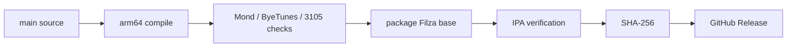

<div align="center">

# 𖤐 FILZA 27 𖤐


<br />

<table>
<tr>
<td align="center" width="50%">
<a href="https://giphy.com/gifs/pokemon-approaching-mega-gengar-phantasmal-flames-2Xk7V7X97R5gmfUTqx">

</a>
</td>
<td align="center" width="50%">
<a href="https://giphy.com/gifs/perfectloop-windows-98-perfectl00p-RbhFAzFEID8Ffrtxyz">

</a>
</td>
</tr>
</table>

<sub>ghost type energy // old computer energy // modern iOS chaos</sub>

<br /><br />

[](https://github.com/NightVibes33/Filza-27/actions/workflows/verify-upstream-byetunes-ssh.yml)
[](https://github.com/NightVibes33/Filza-27/releases/latest)
[](https://github.com/NightVibes33/Filza-27/releases)
[](https://hits.sh/github.com/NightVibes33/Filza-27/)

[](https://github.com/NightVibes33/Filza-27/stargazers)
[](https://github.com/NightVibes33/Filza-27/forks)
[](https://github.com/NightVibes33/Filza-27/issues)
[](https://github.com/NightVibes33/Filza-27/commits/main)

[](https://github.com/NightVibes33/Filza-27)
[](https://github.com/NightVibes33/Filza-27/commits/main)
[](https://github.com/NightVibes33/Filza-27/watchers)

<br />

[](https://github.com/NightVibes33/Filza-27/releases/latest/download/Filza-27.ipa)
[](https://github.com/NightVibes33/Filza-27/releases)
[](RELEASE_NOTES.md)
[](https://github.com/NightVibes33/Filza-27/actions)
[](https://github.com/NightVibes33/Filza-27)

<br />

**Filza 4.11 · Mond 2.1 · ByeTunes · 3105 · WebDAV · SSH**

`arm64` · `sideloadable` · `exact-SHA verified builds` · `iOS 18 / 26 / early 27`

</div>

---

<div align="center">

### ⟡ QUICK NAV ⟡

[**download**](#-download) · [**stack**](#-the-stack) · [**scene**](#-scene) · [**mond**](#-mond-21) · [**compatibility**](#-compatibility) · [**builds**](#-verified-build-pipeline) · [**credits**](#-credits)

</div>

---

<table>
<tr>
<td width="48%" valign="top">

### `STATUS // ONLINE`

```text
╭──────────────────────────────╮
│ FILZA ............. READY    │
│ MOND 2.1 .......... LOADED   │
│ BYETUNES .......... LOADED   │
│ 3105 .............. LOADED   │
│ WEBDAV ............ :11111   │
│ SSH ............... :2222    │
│ ARCH .............. ARM64    │
│ PACKAGE ........... IPA      │
╰──────────────────────────────╯
```

`production package:` **Filza-27.ipa**

`release gate:` **exact-SHA green verifier**

</td>
<td width="52%" align="center" valign="middle">
<a href="https://giphy.com/gifs/computer-apple-mac-kMyqWFWtezej6">

</a>

<sub>1980s Macintosh energy, except it somehow has SSH now.</sub>
</td>
</tr>
</table>

---

## ↓ Download

<div align="center">

# [`Filza-27.ipa`](https://github.com/NightVibes33/Filza-27/releases/latest/download/Filza-27.ipa)

### `latest verified arm64 package`

Every public IPA is published only after the verifier succeeds for the **same commit SHA**.

`Filza-27.ipa` · `Filza-27-SHA256.txt`

[](https://github.com/NightVibes33/Filza-27/releases/latest)
[](https://github.com/NightVibes33/Filza-27/actions/workflows/verify-upstream-byetunes-ssh.yml)

</div>

> [!IMPORTANT]
> **This project does not claim a full jailbreak.** A successful build or accessible container does not establish kernel read/write, unrestricted `/`, a root shell, SPTM bypass, or a writable signed system volume.

---

## ✦ The stack

<table>
<tr>
<td width="33%" valign="top">

### 📁 Filza
Filesystem browser and reachable-container tooling.

`browse` `inspect` `import` `export`

</td>
<td width="33%" valign="top">

### 🟣 Mond 2.1
Pinned upstream Mond integrated into the Filza runtime.

`Gestalt` `Tendies` `Santander`

</td>
<td width="33%" valign="top">

### 🎵 ByeTunes
Embedded music tooling and metadata flows.

`library` `metadata` `backups`

</td>
</tr>
<tr>
<td width="33%" valign="top">

### 🧩 3105
Apps Manager + `.3105` Patch Workspace.

`projects` `receipts` `restore`

</td>
<td width="33%" valign="top">

### 🌐 WebDAV
In-process network file server.

`local network` `:11111`

</td>
<td width="33%" valign="top">

### `>_` SSH
Embedded libssh server.

`password auth` `:2222`

</td>
</tr>
</table>

---

## ◈ Scene

<table>
<tr>
<td width="50%" align="center">
<a href="https://giphy.com/gifs/pokemon-oKXaUOOwStqnDddLnA">

</a>
<br />
<b>GENGAR // NIGHT MODE</b>
</td>
<td width="50%" align="center">
<a href="https://giphy.com/gifs/vaporwave-cyberpunk-futuristic-26tnkzDoBp0NVpQt2">

</a>
<br />
<b>NETWORK // DREAM STATE</b>
</td>
</tr>
</table>

<div align="center">


</div>

---

## ✦ Mond 2.1

Mond is staged from exact pinned upstream source and embedded in the Filza runtime.

```text
rooootdev/mond@500d76082f0ca021ddd591c05d129ebbc26c20df
```

| Route | Included |
| --- | --- |
| MobileGestalt | ✅ |
| PosterBoard / Tendies | ✅ |
| HouseArrest / Santander | ✅ |
| Shared AppState | ✅ |
| Run Exploit | ✅ upstream flow |
| Generate Token | ✅ upstream flow |

<details>
<summary><b>open Mond technical details</b></summary>

<br />

Exact upstream source is preserved under:

```text
ThirdParty/mond-current/Upstream
```

Embedded code receives only the mechanical module/symbol namespacing needed to coexist in the Filza process. Sandbox SPI compatibility is bridged by `MondSandboxSPICompat.c`.

Access-method choices exposed by Mond:

```text
bad_query
cmg
```

MobileGestalt cache:

```text
/private/var/containers/Shared/SystemGroup/systemgroup.com.apple.mobilegestaltcache/Library/Caches/com.apple.MobileGestalt.plist
```

</details>

---

## ◇ Compatibility

<div align="center">


</div>

For iOS 27, useful `bad_query` behavior is associated with **beta 1–4**. Do not assume identical access on beta 5 or newer. Actual access varies by hardware and OS build, so FilzaSlop validates real file/directory access instead of treating a returned handle as automatic success.

---

## ⚡ Live repo telemetry

<div align="center">


<br />


<br /><br />

### contributors

<a href="https://github.com/NightVibes33/Filza-27/graphs/contributors">

</a>

</div>

---

## ✓ Verified build pipeline



Primary verifier:

```text
.github/workflows/verify-upstream-byetunes-ssh.yml
```

Release publisher:

```text
.github/workflows/publish-green-ipa-release.yml
```

The publisher waits for a green verifier at the **same commit SHA**, downloads that exact artifact, validates it, calculates SHA-256, and publishes:

```text
Filza-27.ipa
Filza-27-SHA256.txt
```

---

<details>
<summary><b>🌐 WebDAV + SSH</b></summary>

<br />

### WebDAV

**Preferences → Advanced options → Enable WebDAV server**

```text
Default port: 11111
```

### SSH

**Preferences → SSH SERVER**

```text
Default port: 2222
```

Both services expose only filesystem access already available to the FilzaSlop process. iOS may suspend app-hosted network services while backgrounded.

</details>

<details>
<summary><b>🧾 Runtime logs</b></summary>

<br />

```text
Documents/FilzaSlop Logs/
```

```text
Runtime.log
WebDAVStatus.txt
SSHStatus.txt
ByeTunesEmbedStage.txt
```

</details>

<details>
<summary><b>⚠ Current limitations</b></summary>

<br />

- A green Actions build proves compilation, linking, packaging, and artifact verification—not identical private-API behavior on every device/build.
- `/System/Library` may be readable while remaining on iOS's signed read-only system volume.
- Access to an App Group or data container does not imply unrestricted filesystem access.
- Kernel read/write is not established by this project.
- No full jailbreak, root shell, SPTM bypass, or system-volume remount is claimed.
- WebDAV and SSH are app-hosted and may be suspended in the background.

</details>

---

## ♱ Credits

<div align="center">

[FilzaJailedDS](https://github.com/34306/FilzaJailedDS) · [FilzaSlop](https://github.com/0xjohnnydev/FilzaSlop) · [MobileHouseArrest-PoC](https://github.com/0xjohnnydev/MobileHouseArrest-PoC) · [bad_query](https://github.com/forcequitOS/bad_query) · [mond](https://github.com/rooootdev/mond) · [3105](https://github.com/YangJiiii/3105) · [ByeTunes](https://github.com/EduAlexxis/ByeTunes) · [GCDWebServer](https://github.com/swisspol/GCDWebServer) · [libssh](https://www.libssh.org/)

<sub>XPF / ChOma contributors · CrazyMind90 · SerStars/nugget-wallpapers · mightycooldude12</sub>

<br /><br />

<a href="https://giphy.com/gifs/pokemon-gengar-mimikyu-pokemon-tcg-9CtPkMaR4Yp3NQOZ6u">

</a>

<br />

### `FILZA 27 // END OF FILE`

<sub>README visual experiment on <code>preview/gunslol-readme</code>. Production source behavior is unchanged.</sub>

</div>
