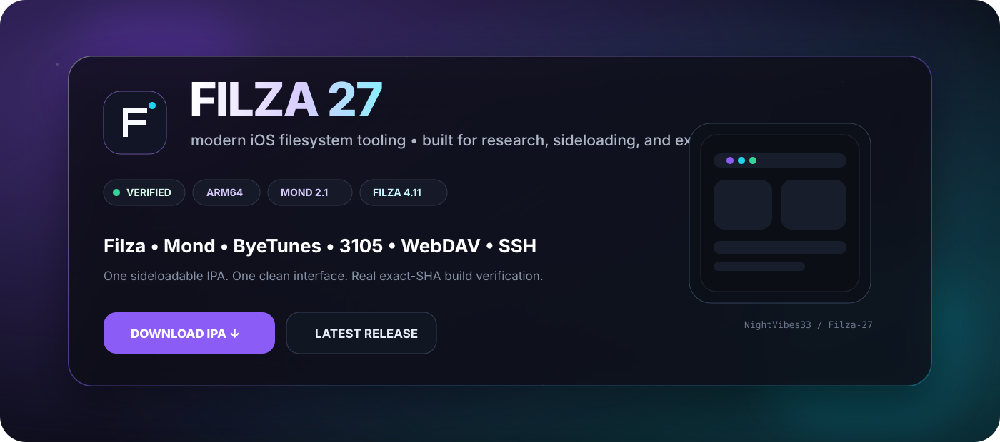
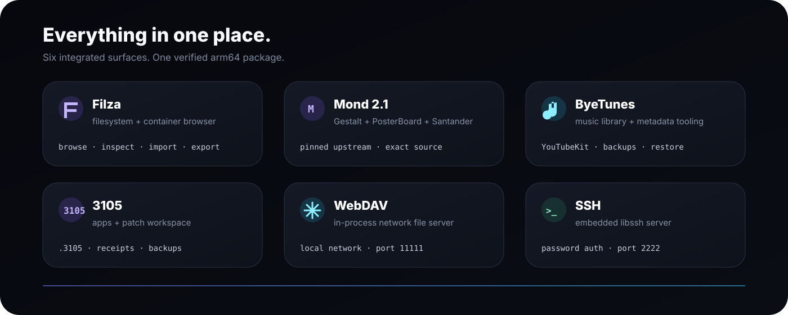

<div align="center">



<br />


<br />

[](https://github.com/NightVibes33/Filza-27/actions/workflows/verify-upstream-byetunes-ssh.yml)
[](https://github.com/NightVibes33/Filza-27/releases/latest)
[](https://github.com/NightVibes33/Filza-27/releases)

<br />

[](https://github.com/NightVibes33/Filza-27/releases/latest/download/Filza-27.ipa)
[](RELEASE_NOTES.md)

<br />

**Modern iOS filesystem tooling with Filza, Mond 2.1, ByeTunes, 3105, WebDAV and SSH inside one sideloadable arm64 IPA.**

`Filza 4.11` · `Mond 2.1` · `arm64` · `iOS 18 / 26 / early 27` · `exact-SHA builds`

</div>

---

## ✦ Everything in one place



<table>
<tr>
<td width="50%" valign="top">

### ◇ Filza + 3105

Browse files and reachable containers, inspect apps, recover icons and disk sizes where available, create/import/replace/archive content, and hand work directly into the `.3105` Patch Workspace.

</td>
<td width="50%" valign="top">

### ◇ Mond 2.1

Pinned upstream Mond 2.1 with **MobileGestalt**, **PosterBoard / Tendies**, **HouseArrest / Santander**, shared `AppState`, and upstream exploit/token controls.

</td>
</tr>
<tr>
<td width="50%" valign="top">

### ◇ ByeTunes

Music library tooling, downloads, metadata editing, backups, restore/repair flows, multi-source metadata routing, and the restored pre-v2.4 YouTubeKit metadata path.

</td>
<td width="50%" valign="top">

### ◇ Network tools

In-process **WebDAV** and **SSH** servers expose the same filesystem access already available to the FilzaSlop process—without pretending the app has permissions it does not actually possess.

</td>
</tr>
</table>

---

<div align="center">

## ✦ Filza 27 — Mond 2.1

### Current production update

</div>

> **Mond is now the full pinned 2.1 source surface, not the older Filza-specific implementation.** The exact upstream source is preserved for provenance, while only mechanical module/symbol namespacing is applied so it can coexist inside Filza.

- **Mond:** `rooootdev/mond@500d76082f0ca021ddd591c05d129ebbc26c20df`
- **Filza base:** anchored Filza 4.11 package
- **3105:** `NightVibes33/3105@90ab4dd35823d58de10e6b8b78236e0e7e1ad32b`
- **Architecture:** arm64
- **Release policy:** exact-SHA verifier must be green before an IPA is published
- **Integrity:** every release includes `Filza-27-SHA256.txt`

<div align="center">

[**View the full release notes →**](RELEASE_NOTES.md)

</div>

---

## ✦ At a glance

| Surface | Production status |
| --- | --- |
| **Filza file browser** | ✅ Included |
| **Apps Manager** | ✅ 3105 1.0.1 integrated |
| **`.3105` Patch Workspace v2** | ✅ Integrated |
| **ByeTunes** | ✅ Integrated |
| **YouTube metadata provider** | ✅ Restored + bundled |
| **Mond** | ✅ Full pinned Mond 2.1 |
| **MobileGestalt** | ✅ Mond route |
| **PosterBoard / Tendies** | ✅ Mond route |
| **HouseArrest / Santander** | ✅ Mond route |
| **WebDAV** | ✅ In-process server |
| **SSH** | ✅ In-process libssh server |
| **Home Screen quick actions** | ✅ Apps · Music · Gestalt · Patches |
| **Full jailbreak / writable system volume** | ❌ Not claimed |

---

## ✦ Compatibility

<div align="center">


</div>

The useful `bad_query` behavior associated with iOS 27 is expected on **beta 1–4**, not beta 5 or newer. Actual access varies by hardware and OS build, so FilzaSlop validates real file/directory access rather than treating a returned handle as automatic success.

> [!IMPORTANT]
> **Filza 27 is not a full jailbreak.** It does not claim kernel read/write, unrestricted `/`, a root shell, SPTM bypass, or a writable system volume.

---

## ✦ Install

1. Download the latest verified [`Filza-27.ipa`](https://github.com/NightVibes33/Filza-27/releases/latest/download/Filza-27.ipa).
2. Sideload it with your preferred signing method.
3. Keep the base identity when your signer permits it:

```text
com.apple.mobile.MobileHouseArrest
```

Changing that bundle identifier can break MobileHouseArrest-dependent behavior.

---

<details>
<summary><b>✦ Mond 2.1 / Gestalt technical details</b></summary>

<br />

Mond 2.1 is staged from exact upstream source and embedded into the Filza runtime. Its exposed routes include:

- MobileGestalt
- PosterBoard / Tendies
- HouseArrest / Santander
- Settings / exploit controls

Access-method choices exposed by Mond:

```text
bad_query
cmg
```

MobileGestalt cache path:

```text
/private/var/containers/Shared/SystemGroup/systemgroup.com.apple.mobilegestaltcache/Library/Caches/com.apple.MobileGestalt.plist
```

The editor includes newer iOS 27 capability mappings alongside Dynamic Island, Always-On Display, Camera Control, Action Button, Stage Manager, Apple Intelligence eligibility, internal-feature, and related controls.

</details>

<details>
<summary><b>✦ WebDAV + SSH</b></summary>

<br />

### WebDAV

Enable from **Preferences → Advanced options → Enable WebDAV server**.

```text
Default port: 11111
```

Accept the Local Network permission prompt when requested. iOS can suspend this app-hosted service while the app is backgrounded.

### SSH

Open **Preferences → SSH SERVER**.

```text
Default port: 2222
```

Set a password before enabling public-facing authentication. SSH filesystem permissions are the same permissions available to the FilzaSlop process itself.

</details>

<details>
<summary><b>✦ Runtime logs</b></summary>

<br />

```text
Documents/FilzaSlop Logs/
```

Key files:

```text
Runtime.log
WebDAVStatus.txt
SSHStatus.txt
ByeTunesEmbedStage.txt
```

</details>

<details>
<summary><b>✦ Build + release verification</b></summary>

<br />

Primary verifier:

```text
.github/workflows/verify-upstream-byetunes-ssh.yml
```

It validates pinned dependencies, stages Mond / 3105 / ByeTunes sources and resources, builds the arm64 runtime, packages the anchored Filza base IPA, verifies the package, and uploads the exact artifact.

Release publisher:

```text
.github/workflows/publish-green-ipa-release.yml
```

The publisher waits for the verifier at the **same commit SHA**, downloads that exact artifact, validates it, calculates SHA-256, and publishes:

```text
Filza-27.ipa
Filza-27-SHA256.txt
```

The GitHub Release body is built from [`RELEASE_NOTES.md`](RELEASE_NOTES.md) plus the exact verifier run and commit SHA.

</details>

<details>
<summary><b>✦ Current limitations</b></summary>

<br />

- A green Actions build proves compilation, linking, packaging, and artifact verification; it cannot prove every private API behaves identically on every device/build.
- `/System/Library` can be readable while still living on iOS's signed read-only system volume.
- Access to an App Group or data container does not imply access to the entire filesystem.
- Kernel read/write is not established by this project.
- No full jailbreak, root shell, SPTM bypass, or system-volume remount is claimed.
- WebDAV and SSH are app-hosted services and may be suspended in the background.

</details>

---

## ✦ Upstream & credits

<div align="center">

[FilzaJailedDS](https://github.com/34306/FilzaJailedDS) · [FilzaSlop](https://github.com/0xjohnnydev/FilzaSlop) · [MobileHouseArrest-PoC](https://github.com/0xjohnnydev/MobileHouseArrest-PoC) · [bad_query](https://github.com/forcequitOS/bad_query) · [mond](https://github.com/rooootdev/mond) · [3105](https://github.com/YangJiiii/3105) · [ByeTunes](https://github.com/EduAlexxis/ByeTunes) · [GCDWebServer](https://github.com/swisspol/GCDWebServer) · [libssh](https://www.libssh.org/)

<sub>XPF / ChOma contributors · CrazyMind90 · SerStars/nugget-wallpapers · mightycooldude12</sub>

<br /><br />

**Filza 27** · filesystem research for modern iOS

<sub>This branch is a README visual concept preview. Production source behavior is unchanged.</sub>

</div>
