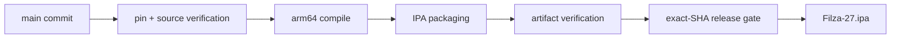

<!-- README design preview only: branch readme-aesthetic-preview -->

<div align="center">


&nbsp;&nbsp;&nbsp;

&nbsp;&nbsp;&nbsp;


# FILZA 27

### `JAILED FILE BROWSER // MODERN iOS RESEARCH TOOLKIT`


<br />

[](#download)
[](https://github.com/NightVibes33/Filza-27/actions/workflows/verify-upstream-byetunes-ssh.yml)
[](https://github.com/NightVibes33/Filza-27/releases/latest)

<br />

`iOS 18` · `iOS 26` · `iOS 27 beta 1–4 research` · `arm64` · `sideloadable IPA`

<br />


<br />

<sub>purple light // terminal glow // ghost energy</sub>

</div>

> [!IMPORTANT]
> **DESIGN PREVIEW BRANCH.** This branch changes the README presentation only. Production remains on `main`.

---

<div align="center">


### FILE ACCESS WITHOUT THE BORING README

A jailed, sideloadable Filza fork combining the core file browser with app/container management, 3105, ByeTunes, Mond 2.1, WebDAV, SSH, MobileGestalt tooling, and modern iOS filesystem research inside one IPA.

**[DOWNLOAD](#download) · [STACK](#the-stack) · [MOND](#mond-21) · [INSTALL](#install) · [BUILDS](#verified-build-pipeline) · [CREDITS](#credits)**

</div>

---

## Download

<div align="center">

[](https://github.com/NightVibes33/Filza-27/releases/latest/download/Filza-27.ipa)

**Exact-SHA verified build from `main`.**  
Every public release includes `Filza-27.ipa` and `Filza-27-SHA256.txt`.

</div>

> [!CAUTION]
> **Filza 27 is not a full jailbreak.** It does not claim kernel read/write, unrestricted `/`, root shell access, an SPTM bypass, or a writable system volume. It exposes what the running process can actually reach on that device/build.

---

## The stack

| | Component | What it does |
|:--:|---|---|
| 📁 | **Filza 4.11** | Core file browser and filesystem UI |
| 📦 | **3105 1.0.1** | Apps Manager + `.3105` Patch Workspace v2 |
| 🎵 | **ByeTunes** | Music library, downloads, metadata, queues, backups |
| 👁️ | **Mond 2.1** | MobileGestalt, Tendies / PosterBoard, HouseArrest / Santander |
| 🌐 | **WebDAV** | In-process network file server |
| ⌨️ | **SSH** | In-process libssh server |
| ⚡ | **Quick Actions** | Apps Manager, Music Library, Gestalt Editor, Patches |
| ✅ | **Green release gate** | Exact-SHA compile, package, verify, then publish |

```text
FILZA 27
│
├── File Browser
├── Apps Manager ─────────────── 3105
├── Patch Workspace ──────────── .3105 v2
├── Music Library ────────────── ByeTunes
├── Gestalt / PosterBoard ────── Mond 2.1
├── Network Access ───────────── WebDAV + SSH
└── Release Gate ─────────────── exact-SHA green build
```

<div align="center">

</div>

---

## Mond 2.1

<details>
<summary><strong>OPEN // Mond integration details</strong></summary>

<br />

The production tree embeds the **full pinned Mond 2.1 functional source surface** instead of the older Filza-specific implementation.

- Pin: `rooootdev/mond@500d76082f0ca021ddd591c05d129ebbc26c20df`
- Full shared `AppState` lifecycle and normal navigation
- MobileGestalt
- PosterBoard / Tendies
- HouseArrest / Santander
- Upstream **Run Exploit** and **Generate Token** flow
- CacheExtra / safe MobileGestalt offset fixes retained
- CMG grant-state fix retained
- Untouched upstream snapshot preserved in `ThirdParty/mond-current/Upstream`
- Generated embedded copy receives only the adapters needed to coexist inside Filza
- Source-completeness gate prevents silent source omissions
- Sandbox SPI ABI forwarding handled through `MondSandboxSPICompat.c`

The MobileGestalt cache used by the editor is:

```text
/private/var/containers/Shared/SystemGroup/systemgroup.com.apple.mobilegestaltcache/Library/Caches/com.apple.MobileGestalt.plist
```

The editor includes newer iOS 27 capability mappings alongside Dynamic Island, Always-On Display, Camera Control, Action Button, Stage Manager, Apple Intelligence eligibility, internal-feature controls, and related keys.

</details>

---

## 3105 / Apps Manager

<details>
<summary><strong>OPEN // Apps Manager + Patch Workspace</strong></summary>

<br />

Apps Manager embeds **3105 1.0.1**, pinned to:

```text
NightVibes33/3105@90ab4dd35823d58de10e6b8b78236e0e7e1ad32b
```

Included operations cover application search, icon and disk-size recovery where available, container browsing, file preview, create/rename/import/replace/delete actions, ZIP creation/extraction, and Patch Workspace handoff.

The `.3105` Patch Workspace v2 supports portable projects, schema-v2 workspaces, legacy-v1 decoding, bundle-ID targets, directory targets, import/export, backups, receipts, transaction journals, and restore flows.

</details>

---

## ByeTunes

<details>
<summary><strong>OPEN // Music tools</strong></summary>

<br />

ByeTunes is embedded directly into Filza 27 and includes library browsing, downloads, persistent queues, backups, restore/repair tools, metadata editing, and multi-source metadata routing.

The current build restores the known working pre-v2.4 YouTubeKit metadata path as the first free YouTube provider while retaining the current ByeTunes integration. Required JavaScript solver resources are packaged in the IPA.

</details>

---

## Network layer

### WebDAV

Enable WebDAV from:

```text
Preferences → Advanced options → Enable WebDAV server
```

Default port:

```text
11111
```

### SSH

Open:

```text
Preferences → SSH SERVER
```

Default port:

```text
2222
```

Both services inherit the filesystem permissions of the Filza 27 process itself.

---

## Install

1. Download the latest verified [`Filza-27.ipa`](https://github.com/NightVibes33/Filza-27/releases/latest/download/Filza-27.ipa).
2. Sideload it with your preferred signing method.
3. Keep the base app identity when your signer allows it:

```text
com.apple.mobile.MobileHouseArrest
```

Changing that bundle identifier can break MobileHouseArrest-dependent behavior.

---

## Verified build pipeline

<div align="center">

[](https://github.com/NightVibes33/Filza-27/actions/workflows/verify-upstream-byetunes-ssh.yml)
[](https://github.com/NightVibes33/Filza-27/releases/latest)

</div>



The verifier stages pinned dependencies, validates the Mond functional-source graph, builds the arm64 target, packages the anchored Filza base IPA, validates the finished package, and uploads the artifact. The release workflow then waits for that exact SHA before publishing it.

---

## Logs

Runtime logs live under:

```text
Documents/FilzaSlop Logs/
```

Useful files include:

```text
Runtime.log
WebDAVStatus.txt
SSHStatus.txt
ByeTunesEmbedStage.txt
```

---

## Compatibility

| Target | Status |
|---|---|
| iOS 18 | Research / supported project target |
| iOS 26 | Research / supported project target |
| iOS 27 beta 1–4 | Early-build research target |
| iOS 27 beta 5+ | Do not assume the same access behavior |
| arm64 IPA | Verified by CI |
| Full jailbreak | Not claimed |

---

## Current limitations

- A green Actions build proves compilation, linking, packaging, and artifact verification; it cannot prove every private API behaves identically on every device/build.
- `/System/Library` can be readable while remaining on iOS's signed read-only system volume.
- App Group or data-container access does not imply unrestricted filesystem access.
- Kernel read/write is not established by this project.
- No full jailbreak, root shell, SPTM bypass, or system-volume remount is claimed.
- WebDAV and SSH are app-hosted and can be suspended when iOS backgrounds the app.

---

## Credits

- [34306/FilzaJailedDS](https://github.com/34306/FilzaJailedDS)
- [0xjohnnydev/FilzaSlop](https://github.com/0xjohnnydev/FilzaSlop)
- [0xjohnnydev/MobileHouseArrest-PoC](https://github.com/0xjohnnydev/MobileHouseArrest-PoC)
- [forcequitOS/bad_query](https://github.com/forcequitOS/bad_query)
- [rooootdev/mond](https://github.com/rooootdev/mond)
- [YangJiiii/3105](https://github.com/YangJiiii/3105)
- [NightVibes33/3105](https://github.com/NightVibes33/3105)
- [EduAlexxis/ByeTunes](https://github.com/EduAlexxis/ByeTunes)
- [swisspol/GCDWebServer](https://github.com/swisspol/GCDWebServer)
- [libssh](https://www.libssh.org/)
- XPF and ChOma contributors
- CrazyMind90
- `SerStars/nugget-wallpapers`
- mightycooldude12

---

<div align="center">


&nbsp;&nbsp;


### `SEE YOU IN /private/var`


<sub>README aesthetic preview // no production changes on main</sub>

</div>
